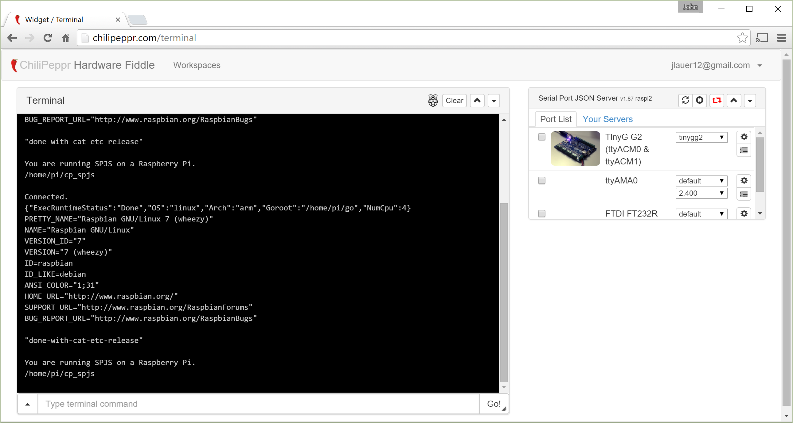

# com-chilipeppr-workspace-nodemcu
A ChiliPeppr Workspace that lets you interact with the NodeMCU device. The NodeMCU device is an ESP8266 wifi module with an attached USB serial port bridge so you can easily use it and program it from your computer via the serial port. Thus, the NodeMCU works brilliantly with ChiliPeppr. Secondly, the NodeMCU has the Lua language preloaded onto the ESP8266 so you can easily program the device.This workspace gives you convenience methods for programming the NodeMCU device. You can buy the ESP8266 on ebay.com or aliexpress.com.



## ChiliPeppr Workspace / NodeMCU

All ChiliPeppr workspaces/widgets/elements are defined using cpdefine() which is a method
that mimics require.js. Each defined object must have a unique ID so it does
not conflict with other ChiliPeppr objects.

| Item                  | Value           |
| -------------         | ------------- | 
| ID                    | com-chilipeppr-workspace-nodemcu |
| Name                  | Workspace / NodeMCU |
| Description           | A ChiliPeppr Workspace that lets you interact with the NodeMCU device. The NodeMCU device is an ESP8266 wifi module with an attached USB serial port bridge so you can easily use it and program it from your computer via the serial port. Thus, the NodeMCU works brilliantly with ChiliPeppr. Secondly, the NodeMCU has the Lua language preloaded onto the ESP8266 so you can easily program the device.This workspace gives you convenience methods for programming the NodeMCU device. You can buy the ESP8266 on ebay.com or aliexpress.com. |
| chilipeppr.load() URL | http://raw.githubusercontent.com/chilipeppr/workspace-nodemcu/master/auto-generated-workspace.html |
| Edit URL              | http://ide.c9.io/chilipeppr/workspace-nodemcu |
| Github URL            | http://github.com/chilipeppr/workspace-nodemcu |
| Test URL              | https://preview.c9users.io/chilipeppr/workspace-nodemcu/workspace.html |

## Example Code for chilipeppr.load() Statement

You can use the code below as a starting point for instantiating this workspace 
from ChiliPeppr's Edit Boot Script dialog box. The key is that you need to load 
your workspace inlined into the standard #pnlWorkspace div so the DOM can parse your HTML, CSS, and 
Javascript. Then you use cprequire() to find your workspace's Javascript and get 
back the instance of it to init() it.

```javascript
// This code should be pasted into the ChiliPeppr Edit Boot Javascript dialog box
// located in the upper right corner of any chilipeppr.com page.
// The ChiliPeppr environment has a standard div called #pnlWorkspace that
// this workspace should be loaded into.
chilipeppr.load(
  "#pnlWorkspace",
  "http://raw.githubusercontent.com/chilipeppr/workspace-nodemcu/master/auto-generated-workspace.html",
  function() {
    // Callback after workspace loaded into #pnlWorkspace
    // Now use require.js to get reference to instantiated workspace
    cprequire(
      ["inline:com-chilipeppr-workspace-nodemcu"], // the id you gave your workspace
      function(myWorkspaceWorkspaceNodemcu) {
        // Callback that is passed reference to the newly loaded workspace
        console.log("Workspace / NodeMCU just got loaded.", myWorkspaceWorkspaceNodemcu);
        myWorkspaceWorkspaceNodemcu.init();
      }
    );
  }
);

```

## Publish

This workspace publishes the following signals. These signals are owned by this workspace and are published to 
all objects inside the ChiliPeppr environment that listen to them via the 
chilipeppr.subscribe(signal, callback) method. 
To better understand how ChiliPeppr's subscribe() method works see amplify.js's documentation at http://amplifyjs.com/api/pubsub/

  <table id="com-chilipeppr-elem-pubsubviewer-pub" class="table table-bordered table-striped">
      <thead>
          <tr>
              <th style="">Signal</th>
              <th style="">Description</th>
          </tr>
      </thead>
      <tbody>
      <tr><td colspan="2">(No signals defined in this workspace)</td></tr>    
      </tbody>
  </table>

## Subscribe

This workspace subscribes to the following signals. These signals are owned by this workspace. 
Other objects inside the ChiliPeppr environment can publish to these signals via the chilipeppr.publish(signal, data) method. 
To better understand how ChiliPeppr's publish() method works see amplify.js's documentation at http://amplifyjs.com/api/pubsub/

  <table id="com-chilipeppr-elem-pubsubviewer-sub" class="table table-bordered table-striped">
      <thead>
          <tr>
              <th style="">Signal</th>
              <th style="">Description</th>
          </tr>
      </thead>
      <tbody>
      <tr><td colspan="2">(No signals defined in this workspace)</td></tr>    
      </tbody>
  </table>

## Foreign Publish

This workspace publishes to the following signals that are owned by other objects. 
To better understand how ChiliPeppr's subscribe() method works see amplify.js's documentation at http://amplifyjs.com/api/pubsub/

  <table id="com-chilipeppr-elem-pubsubviewer-foreignpub" class="table table-bordered table-striped">
      <thead>
          <tr>
              <th style="">Signal</th>
              <th style="">Description</th>
          </tr>
      </thead>
      <tbody>
      <tr><td colspan="2">(No signals defined in this workspace)</td></tr>    
      </tbody>
  </table>

## Foreign Subscribe

This workspace publishes to the following signals that are owned by other objects.
To better understand how ChiliPeppr's publish() method works see amplify.js's documentation at http://amplifyjs.com/api/pubsub/

  <table id="com-chilipeppr-elem-pubsubviewer-foreignsub" class="table table-bordered table-striped">
      <thead>
          <tr>
              <th style="">Signal</th>
              <th style="">Description</th>
          </tr>
      </thead>
      <tbody>
      <tr><td colspan="2">(No signals defined in this workspace)</td></tr>    
      </tbody>
  </table>

## Methods / Properties

The table below shows, in order, the methods and properties inside the workspace object.

  <table id="com-chilipeppr-elem-methodsprops" class="table table-bordered table-striped">
      <thead>
          <tr>
              <th style="">Method / Property</th>
              <th>Type</th>
              <th style="">Description</th>
          </tr>
      </thead>
      <tbody>
      <tr valign="top"><td>id</td><td>string</td><td>"com-chilipeppr-workspace-nodemcu"<br><br>The ID of the widget. You must define this and make it unique.</td></tr><tr valign="top"><td>name</td><td>string</td><td>"Workspace / NodeMCU"</td></tr><tr valign="top"><td>desc</td><td>string</td><td>"A ChiliPeppr Workspace that lets you interact with the NodeMCU device. The NodeMCU device is an ESP8266 wifi module with an attached USB serial port bridge so you can easily use it and program it from your computer via the serial port. Thus, the NodeMCU works brilliantly with ChiliPeppr. Secondly, the NodeMCU has the Lua language preloaded onto the ESP8266 so you can easily program the device.This workspace gives you convenience methods for programming the NodeMCU device. You can buy the ESP8266 on ebay.com or aliexpress.com."</td></tr><tr valign="top"><td>url</td><td>string</td><td>"http://raw.githubusercontent.com/chilipeppr/workspace-nodemcu/master/auto-generated-workspace.html"</td></tr><tr valign="top"><td>fiddleurl</td><td>string</td><td>"http://ide.c9.io/chilipeppr/workspace-nodemcu"</td></tr><tr valign="top"><td>githuburl</td><td>string</td><td>"http://github.com/chilipeppr/workspace-nodemcu"</td></tr><tr valign="top"><td>testurl</td><td>string</td><td>"http://workspace-nodemcu-chilipeppr.c9users.io/workspace.html"</td></tr><tr valign="top"><td>widgetConsole</td><td>object</td><td>Contains reference to the Console widget object.</td></tr><tr valign="top"><td>widgetSpjs</td><td>object</td><td>Contains reference to the Serial Port JSON Server object.</td></tr><tr valign="top"><td>widgetLuaEditor</td><td>object</td><td>Contains reference to the Lua Editor widget.</td></tr><tr valign="top"><td>init</td><td>function</td><td>function () <br><br>The workspace's init method. It loads the Console widget and then the SPJS widget.</td></tr><tr valign="top"><td>setupNodeMcuCommands</td><td>function</td><td>function () <br><br>Setup all the command buttons to do their thing.</td></tr><tr valign="top"><td>onClickReset</td><td>function</td><td>function (evt) </td></tr><tr valign="top"><td>onClickHeap</td><td>function</td><td>function (evt) </td></tr><tr valign="top"><td>onClickChipId</td><td>function</td><td>function (evt) </td></tr><tr valign="top"><td>onClickChipInfo</td><td>function</td><td>function (evt) </td></tr><tr valign="top"><td>onClickFlashId</td><td>function</td><td>function (evt) </td></tr><tr valign="top"><td>onClickFsInfo</td><td>function</td><td>function (evt) </td></tr><tr valign="top"><td>onClickListFiles</td><td>function</td><td>function (evt) </td></tr><tr valign="top"><td>onClickCreateTestFile</td><td>function</td><td>function (evt) </td></tr><tr valign="top"><td>onClickReadTestFile</td><td>function</td><td>function (evt) </td></tr><tr valign="top"><td>onClickReadInitFile</td><td>function</td><td>function (evt) </td></tr><tr valign="top"><td>onClickCreateInitFile</td><td>function</td><td>function (evt) </td></tr><tr valign="top"><td>onClickFormat</td><td>function</td><td>function (evt) </td></tr><tr valign="top"><td>onClickBlink</td><td>function</td><td>function (evt) </td></tr><tr valign="top"><td>onClickReadVdd33</td><td>function</td><td>function (evt) </td></tr><tr valign="top"><td>onClickListAps</td><td>function</td><td>function (evt) </td></tr><tr valign="top"><td>sendCtr</td><td>number</td><td></td></tr><tr valign="top"><td>send</td><td>function</td><td>function (txt) <br><br>Send the script off to the serial port.</td></tr><tr valign="top"><td>getBillboard</td><td>function</td><td>function () <br><br>Returns the billboard HTML, CSS, and Javascript for this Workspace. The billboard
is used by the home page, the workspace picker, and the fork pulldown to show a
consistent name/image/description tag for the workspace throughout the ChiliPeppr ecosystem.</td></tr><tr valign="top"><td>addBillboardToWorkspaceMenu</td><td>function</td><td>function () </td></tr><tr valign="top"><td>setupResize</td><td>function</td><td>function () <br><br>Listen to window resize event.</td></tr><tr valign="top"><td>onResize</td><td>function</td><td>function () <br><br>When browser window resizes, forcibly resize the Console window</td></tr><tr valign="top"><td>loadConsoleWidget</td><td>function</td><td>function (callback) <br><br>Load the Console widget via chilipeppr.load()</td></tr><tr valign="top"><td>loadSpjsWidget</td><td>function</td><td>function (callback) <br><br>Load the Serial Port JSON Server widget via chilipeppr.load()</td></tr><tr valign="top"><td>loadFlashMsg</td><td>function</td><td>function () <br><br>Load Flash Module so we can show flash messages.</td></tr><tr valign="top"><td>loadWorkspaceMenu</td><td>function</td><td>function () <br><br>Load the workspace menu.</td></tr><tr valign="top"><td>loadLuaEditor</td><td>function</td><td>function () <br><br>Load the widget for the Lua Editor which is based on the Macro widget from
the TinyG workspace.</td></tr>
      </tbody>
  </table>


## About ChiliPeppr

[ChiliPeppr](http://chilipeppr.com) is a hardware fiddle, meaning it is a 
website that lets you easily
create a workspace to fiddle with your hardware from software. ChiliPeppr provides
a [Serial Port JSON Server](https://github.com/johnlauer/serial-port-json-server) 
that you run locally on your computer, or remotely on another computer, to connect to 
the serial port of your hardware like an Arduino or other microcontroller.

You then create a workspace at ChiliPeppr.com that connects to your hardware 
by starting from scratch or forking somebody else's
workspace that is close to what you are after. Then you write widgets in
Javascript that interact with your hardware by forking the base template 
widget or forking another widget that
is similar to what you are trying to build.

ChiliPeppr is massively capable such that the workspaces for 
[TinyG](http://chilipeppr.com/tinyg) and [Grbl](http://chilipeppr.com/grbl) CNC 
controllers have become full-fledged CNC machine management software used by
tens of thousands.

ChiliPeppr has inspired many people in the hardware/software world to use the
browser and Javascript as the foundation for interacting with hardware. The
Arduino team in Italy caught wind of ChiliPeppr and now
ChiliPeppr's Serial Port JSON Server is the basis for the 
[Arduino's new web IDE](https://create.arduino.cc/). If the Arduino team is excited about building on top
of ChiliPeppr, what
will you build on top of it?

